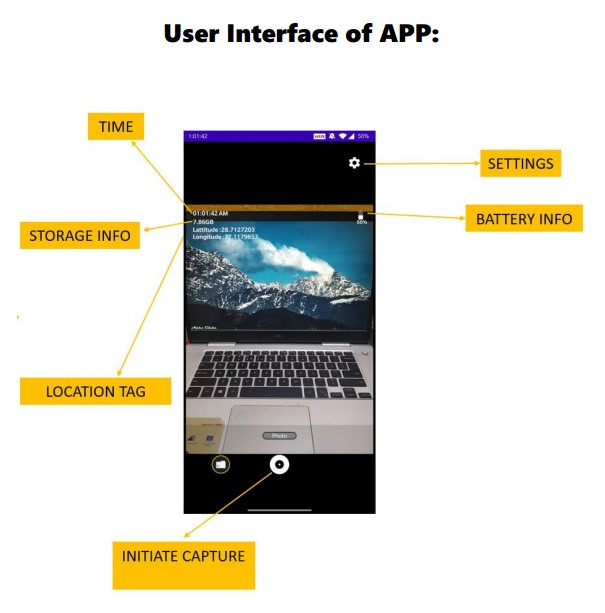
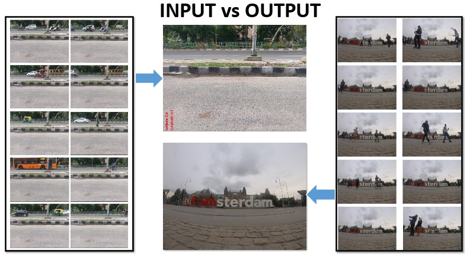

# [BlendToMend](https://github.com/Praveen101997/BlendToMend)

This application is a use to Remove unwanted (moving) objects from a burst of 10+ images to output the final image which consists of only the stable objects.
 
The app named BlendToMend has been developed with the aim of removing most of the unwanted and moving objects from a burst if 10+ images captured to render a final image which only contains the stable, non-moving objects which are desirable during a monument/landscape photography scenario.

The application has been tested with:

* Android Compile SDK '29'
* Android Build Tools '29.0.3'
* Gradle '3.4.1 '
* OpenCV SDK '3.4.1'

## Configuration / Usage:

Here is how to use this project to run native `OpenCV` code.

* Make sure you have `Android SDK` up to date, with `NDK` installed
* Download [OpenCV SDK 3.4.1](https://sourceforge.net/projects/opencvlibrary/files/opencv-android/) for Android from OpenCV.org and decompress the zip file.
* Clone [this project](https://github.com/Praveen101997/BlendToMend)
* Create a symlink named `jniLibs` in `app/src/main` that points to `${YOUR_HOME_OPENCV_SDK}/sdk/native/libs`
* Sync gradle
* Run the application

### Notes:

- The openCVLibaray341 library inside the project contains the java code of 
`/openCVLibrary341/src/main/java`, copied from the `${YOUR_HOME_OPENCV_SDK}/sdk/java/src` folder.
----

## Sample App Image

----

## Sample App Run

